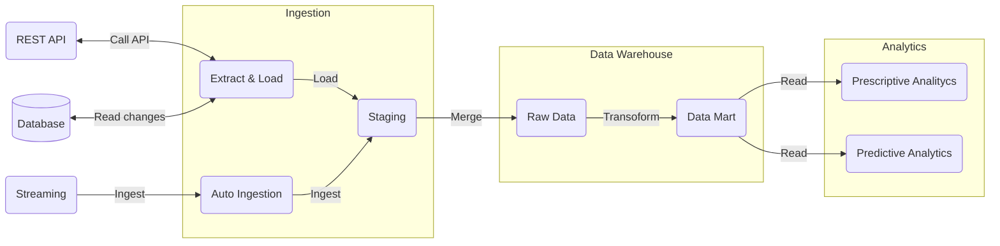
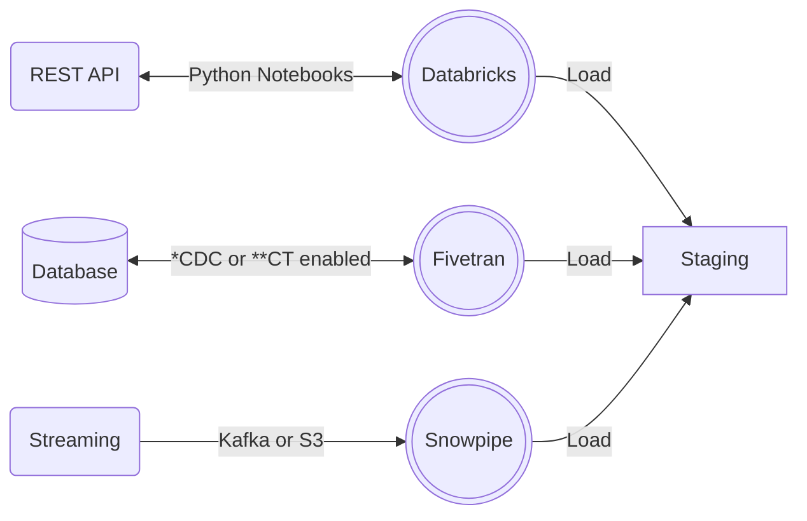
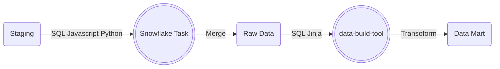

# Cloud Data Platform Architecture

## A tool agnostic approach

## A tooling approach

Assumptions made are:
- The team has chosen 
  - [Snowflake](https://www.snowflake.com/) as the cloud data platform for analytics.
  - Apache Airflow [Astronomer Fully Managed](https://www.astronomer.io/)) as the data pipeline orchestrator.
  - [GitLab](https://gitlab.com/) as the version control system and CI/CD tool.
  - to write less code as possible for extracting from the relational databases.
  - Python 3.10 across the different stages of the data pipeline. 
  - to stream events from Kafka and S3
  - [dbt Cloud](https://www.getdbt.com/product/what-is-dbt/) as the tool for implementing transformation and build data marts for analytics.

### Extraction and ingestion

- Databricks can leverage data to Snowflake by calling APIs, reading from relational and NoSQL databases, and is able to scale easily to adjust to and increasing workload.
- [Fivetran](https://www.fivetran.com/) can reliabily leverage data to Snowflake reading from relational database (as per requirement) with the least developing effort and a small administrative effort, as long as the source database has the Change Data Capture or Change Tracking feature enabled.     
- Snowflake can automatically ingest data from Kafka and S3.  

(*) CDC = Change Data Capture

(**) CT = Change Tracking

### Transformation

- Snowflake provides schedulable and executable Tasks that can run SQL, Javascript, and - in the foreseeable future - Python code. 
- Dbt (data-build-tool) can levarage reliable data models for analytics by using SQL and YAML, for implemeting also schema and data tests and adopting Continous Integration out of the box. 

### Data access

### Data warehousing

### BI-tool for analysts

### Orchestration

