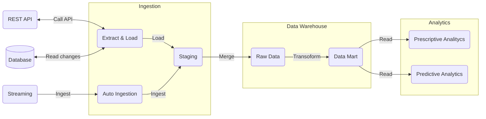

```mermaid

flowchart LR;
  
  source_api(REST API) <--> 
    |Call API| extract_n_load

  source_database[(Database)] <-->
    |Read changes| extract_n_load

  source_stream(Streaming) -->
    |Ingest| auto_ingestions          
   
  subgraph Ingestion

    extract_n_load(Extract & Load) -->
      |Load| staging

    auto_ingestions(Auto Ingestion) -->
      |Ingest| staging
      
  end

  subgraph Data Warehouse

    staging(Staging) -->
      |Merge| raw_data

    raw_data(Raw Data) -->
      |Transoform| mart

  end
    
  subgraph Analytics

    mart(Data Mart) --> 
      | Read | prescriptive(Prescriptive Analitycs)

    mart(Data Mart) --> 
      | Read | predictive(Predictive Analytics)

  end
   
```
