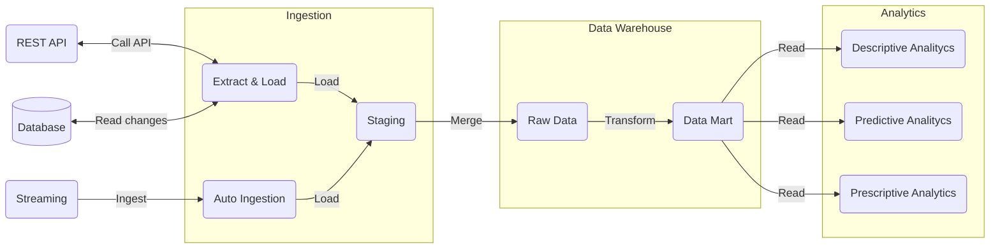
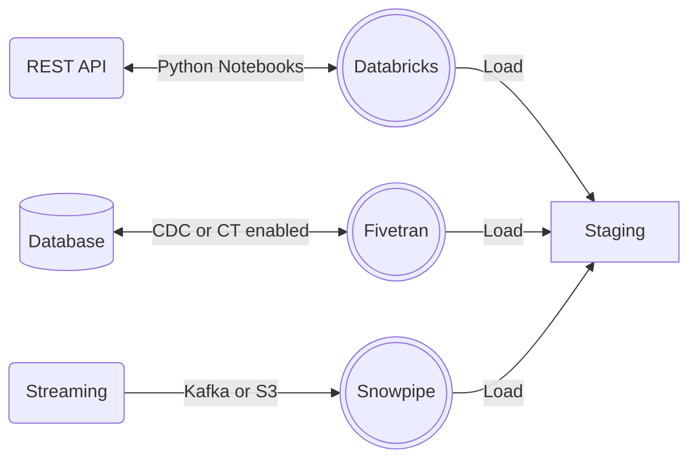
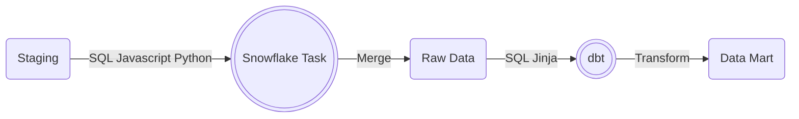
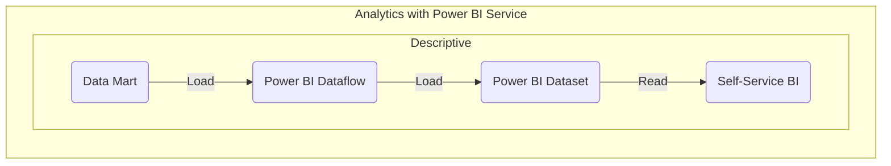

# Cloud Data Platform Architecture

## A tool agnostic approach

## A tool approach

Assumptions made are:
- The team has chosen 
  - [Snowflake](https://www.snowflake.com/) as the cloud data platform for analytics.
  - Apache Airflow [Astronomer Fully Managed](https://www.astronomer.io/) as the data pipeline orchestrator.
  - [GitLab](https://gitlab.com/) as the version control system and CI/CD tool.
  - [dbt Cloud](https://www.getdbt.com/product/what-is-dbt/) as the tool for implementing transformation and build data marts for analytics.
  - [Databricks](https://www.databricks.com/) as tool to run ETL/ELT code
  - to use a "robotic ETL tool" like [Fivetran](https://www.fivetran.com/) when possible and convinient from a cost standpoint.
  - to stream events from Kafka and S3.
  - Python 3.10 as primary programming language across the different stages of the data pipeline. 
  - SQL as language for data modeling
  

### Extraction and ingestion

- Databricks can deliver data to Snowflake by calling APIs, reading from relational and NoSQL databases, while is able to easily scale to adjust to a changable workload.
- As long as the source database has the Change Data Capture (CDC) or Change Tracking (CT) feature enabled, Fivetran can reliably deliver data to Snowflake reading from relational database (as per requirement) with the least developing effort and a small administrative effort.     
- Snowflake can automatically ingest data from Kafka and S3 using [Snowpipe](https://docs.snowflake.com/en/user-guide/data-load-snowpipe.html). 

### Transformation, documentation, schema & data test

- Snowflake provides schedulable and executable Tasks that can run SQL, Javascript, and - in the foreseeable future - Python code. 
- Dbt (data-build-tool) can levarage highly maintainable transformations to deliver data models for analytics by using SQL and YAML. It also allows implemeting schema and data tests, developing with continous integration, and documenting the data models. 

### Data access

Analysts are granted read-only access only to data marts, in order to mitigate "schema drifts".

### Data warehousing

Kimball's dimensional modeling is generally adopted for developting the data warehouse. In practical terms, this translates into developing multiple data marts focused on different business areas using a [star schema](https://en.wikipedia.org/wiki/Star_schema) model, which is made out of a fact table that holds measures, referenced by dimensions that holds the business context, which can be shared among the different data marts of the data warehouse.      

### BI tool for analysts

#### Descriptive analytics

Analysts are given the choice to use Tableau Online or Power BI Service to consume the data through the data marts provided by Snowflake.
They are also encouraged to run analysis from within the BI tool cloud storage, that means reading from Snowflake as least as possible to load the data into the BI service instead of running direct queries against Snowflake that would result into higher costs for the Snowflake compute.

#### Predictive and prescriptive analytics

Analysts can use Databricks Machine Learning to run predictive and prescriptive models on top of the data provided by Snowflake via dedicated data marts for ML. 
